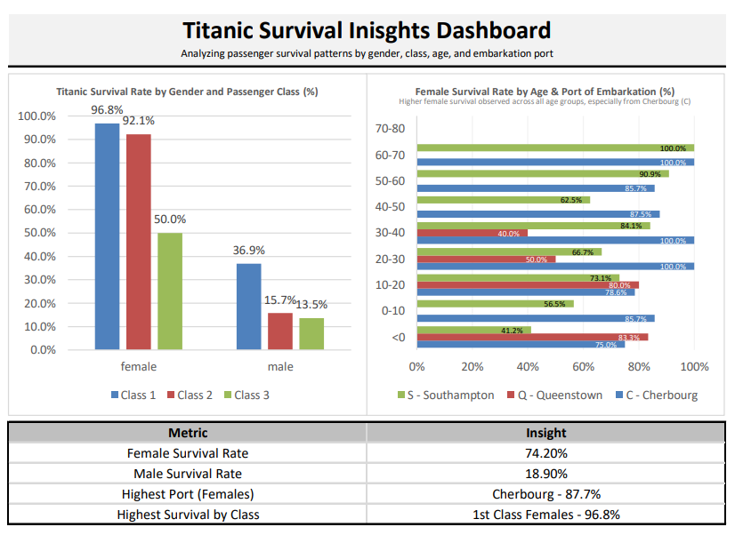

# 🛳️ Titanic Survival Insights Dashboard

An interactive Excel dashboard analyzing survival patterns among Titanic passengers — exploring how **gender, class, age,** and **port of embarkation** influenced survival outcomes.

Built entirely in **Excel**, leveraging advanced PivotTables, calculated fields, and visual storytelling.

---

## Dashboard Preview


> **Key Insight:** Females in 1st Class had the highest survival rate — **96.8%**, while male survival rates rarely exceeded 37%.

---

## Project Files

```
blakusnaku-titanic-dashboard
│
├── data_raw/ 
│   ├── titanic_raw.csv
│
├── data_cleaned/
│   ├── titanic_cleaned.xlsx
│
├── dashboards/
│   ├── titanic_dashboard_v1.xlsx
│   ├── titanic_dashboard_v1.pdf
│
├── docs/
│
├── assets/
│   ├── titanic_dashboard.v1.PNG
│
├── README.md 
├── reflection.md
```

---

## Versions
| Version | Files | Notes |
|---|---|---|
| v1 | [PDF](dashboards/titanic_dashboard_v1.pdf) · [XLSX](dashboards/titanic_dashboard_v1.xlsx) | First release |


## Tools & Techniques
- Microsoft Excel (PivotTables, Calculated Fields, Chart Design)
- Data Cleaning (Null handling, field categorization)
- Visualization Design (Bar charts, percentage formatting, data storytelling)
- Version control via GitHub

---

## Related Projects
| Project | Description | Link |
|----------|--------------|------|
| 🏪 Superstore Data Cleaning | Excel-based data wrangling & normalization workflow | [View Repo →](https://github.com/blakusnaku/blakusnaku-superstore-cleaning) |
| 📁 Analytics Portfolio | Central portfolio linking all projects | [Main Portfolio →](https://github.com/blakusnaku/blakusnaku-analytics-portfolio) |

---

## Future Enhancements
- Add **male survival analysis** by port and class  
- Incorporate **calculated survival ratios** inside Excel pivot fields  
- Create a **v2 Dashboard layout** with consistent chart styles across datasets  
- Explore potential automation using Python (pandas) for data cleaning

---

## Credits
All projects by **JP Malit (@blakusnaku)**  
*Data source: Titanic dataset (Kaggle / public domain)*  

© 2025 JP Malit — Analytics Portfolio. All rights reserved.  
[← Back to Main Portfolio](https://github.com/blakusnaku/blakusnaku-analytics-portfolio)
